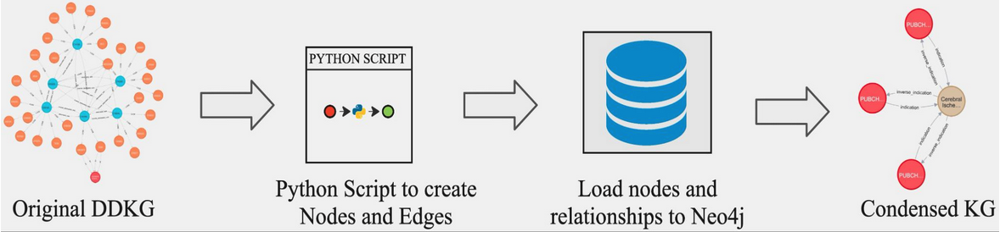

# `CFDE Distillery Project - IDG` 

The CFDE Data Distillery Partnership Project, led by the CFDE HuBMAP, SenNet, and Kids
First teams, from Pitt and Children's Hospital of Philadelphia (CHOP) has developed a
Data Distillery Knowledge Graph (DDKG), which distills Common Fund data with semantic
interoperability, to support integrative biomedical research questions and 
scientific use cases.

The IDG-DCC team brings to this project a strong record of research in KG design,
analytics and KG-based ML. This repo represents the contributions of the IDG team
at the University of New Mexico. The IDG team has focused on including IDG datasets
into the DDKG, and developing IDG scientific use cases combining datasets from IDG and multiple
other Common Fund programs. In addition, the IDG team has developed the _Condensed KG_,
derived from the DDKG, but subsetted and scoped for IDG use cases, and simplified for
interpretability and usability, 

## Condensed-KG

Hosting the comprehensive DDKG requires significant computational resources, and for IDG 
applications, a small fraction of the data is required, and a lightweight subset is advantageous.
To address this challenge, we developed a localized, cloud-ready, containerized KG.
Drawing inspiration from the LINCS-DCC (Maayan Lab) project, we
created a "Condensed-KG" derived and subsetted from the latest DDKG. This Condensed-KG,
consisting of 8 distinct node labels and 1042 distinct relationship types, is designed to simplify
and enhance interpretability, specifically tailored to IDG use cases.

## KG2ML

The KG2ML module was developed
to transform the KG into vector embeddings and an ML-ready dataset, designed
to predict genes/proteins associated with a given disease/condition
but lacking explicit links within the KG. Built upon our prior works in KG-based ML and
positive-unlabeled (PU) learning, KG2ML estimates the proportion of genes/proteins 
thereby associated indirectly with a disease/condition, providing well-calibrated
predictions on the association between genes/proteins and a specified disease/condition.

## DDKG IDG Nodes and Edges files

### How to load data from TSV files to Neo4J KG

- Download:
  -  [compound_activity_input.tsv.gz](https://unmtid-dbs.net/download/cfde/distillery/compound_activity_input.tsv.gz)
  -  [drug_disease_input.tsv.gz](https://unmtid-dbs.net/download/cfde/distillery/drug_disease_input.tsv.gz)
  -  [compound_name_drugbank_id.pkl](https://unmtid-dbs.net/download/cfde/distillery/compound_name_drugbank_id.pkl)
- If TCRD/DrugCentral databases changed, run `compound_activity.sql` and `drug_central_data.sql` present in the "sql" folder to get input data from TCRD and DrugCentral databases.
- Update the input and output files path in `drugcentral_nodes.py`, `drugcentral_edges.py`, `nodes.py`, and `edges.py` and run these codes.
- Move all output TSV files for nodes and edges to the "import" folder of the Neo4J database you created.
- In Neo4J database settings, set dbms.memory.heap.max\_size=8G. If it gives error, increase the value to a bigger number (e.g. 16gb).
- Run all Cypher queries present in the "cql" folder.

## Links

 * [NIH-CFDE.org](https://www.nih-cfde.org/)
 * [Distillery Partnership Home Page](https://github.com/nih-cfde/data-distillery/)
 * [Unified Biomedical Knowledge Graph (UBKG)](https://ubkg.docs.xconsortia.org/)
 * [CFDE_DataDistillery GitHub Repository](https://github.com/TaylorResearchLab/CFDE_DataDistillery)
 * [Poster: Illuminating the Druggable Genome (IDG) scientific use cases powered by the CFDE Data Distillery biomedical knowledge graph, integrating multiple Common Fund datasets](https://doi.org/10.5281/zenodo.10895777), Common Fund Data Ecosystem (CFDE) Meeting, Mar 19-20, 2024. 
 * [Downloads for Distillery-IDG](https://unmtid-dbs.net/download/cfde/distillery/)
