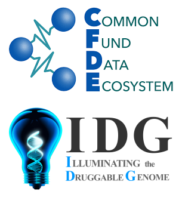

# cfde-distillery 

## Overview

The CFDE Data Distillery Partnership Project, led by the CFDE HuBMAP, SenNet, and Kids
First teams, from Pitt and Children's Hospital of Philadelphia (CHOP) has developed a
Data Distillery Knowledge Graph (DDKG), which distills Common Fund data with semantic
interoperability, to support integrative biomedical research questions and 
scientific use cases.

This repo represents the contributions of the IDG-DCC team at the University
of New Mexico. The IDG team has focused on including IDG datasets into the DDKG,
and developing IDG scientific use cases combining datasets from IDG and multiple
other Common Fund programs. The IDG team brings to this project a strong record
of research in KG design, analytics and KG-based ML.

## Nodes and Edges files
All input and output files are here: https://drive.google.com/drive/folders/1eUcYVayYHM90ESrQqpx8GAcEYOXUCr-i and https://chiltepin.health.unm.edu/x/cfde/distillery/data/

## How to load data from TSV files to Neo4J KG
- Download compound_activity_input.tsv, drug_disease_input.tsv, and drugbank_id.pkl from https://drive.google.com/drive/folders/1eUcYVayYHM90ESrQqpx8GAcEYOXUCr-i
- If TCRD/DrugCentral databases changed, run compound_activity.sql and drug_central_data.sql present in the "sql" folder to get input data from TCRD and DrugCentral databases.
- Update the input and output files path in drugcentral_nodes.py, drugcentral_edges.py, nodes.py, and edges.py and run these codes.
- Move all output TSV files for nodes and edges to the "import" folder of the Neo4J database you created.
- In Neo4J database settings, set dbms.memory.heap.max_size=8G. If it gives error, increase the value to a bigger number (e.g. 16gb).
- Run all Cypher queries present in the "cql" folder.

## Links

 * [NIH-CFDE.org](https://www.nih-cfde.org/)
 * [Distillery Partnership Home Page](https://github.com/nih-cfde/data-distillery/)
 * [Unified Biomedical Knowledge Graph (UBKG)](https://ubkg.docs.xconsortia.org/)
 * [CFDE_DataDistillery GitHub Repository](https://github.com/TaylorResearchLab/CFDE_DataDistillery)
