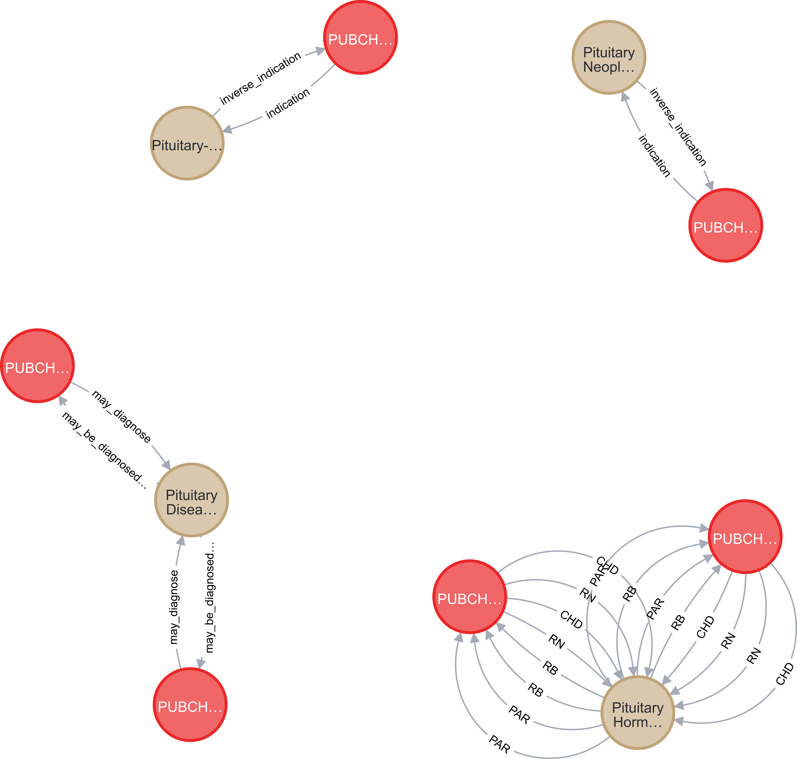

### 1) Chronic Heart Failure in UBKG:

MATCH (a:Concept )-[: CODE]->(b:Code{SAB:'HGNC'})
MATCH (c:Concept )-[: CODE]-(d:Code {SAB:'SNOMEDCT_US'})-[:PT]-(e:Term)
MATCH (f:Concept )-[: CODE]-(g:Code {SAB:'PUBCHEM'})
MATCH (a)-[r1 {SAB:'LINCS'}]-(f)-[r2:indication {SAB:'IDGD'}]-(c)
WHERE e.name="Chronic heart failure"
RETURN *;

Count: 1298

Chronic Heart Failure in Condensed-KG:

MATCH (d:Disease )-[r:indication ]-(c:Compound )-[r1:bioactivity]-(b:Protein )-[r2]-(a:Gene)
WHERE d.node_label CONTAINS "Chronic heart failure"
RETURN * ;

Count: 38

—-------------------------------------------------------------------------------------------------------------------------

### 2) Cerebral infarction in UBKG:

with ['cerebral infarction'] as disease
match (hpo_concept:Concept)-[:CODE]-(hpo_code:Code )-[:PT]-(hpo_term:Term)
match (gene_concept:Concept)-[:CODE]->(gene_code:Code)
match (pubchem_concept:Concept)-[:CODE]->(pubchem_code:Code
{SAB:'SNOMEDCT_US'})
match gr=(hpo_concept)-[r1:associated_with]-(gene_concept)-[r2]-(pubchem_concept)
where hpo_term.name in disease Return * ;

Count: 937144

-—-------------------------------------------------------------------------------------------------------------------------

### 3) Cerebral Ischemia in Condensed-KG:

match (c:Compound)-[r:indication]-(d:Disease)
where d.node_label contains "Cerebral Ischemia"
return *;

Count: 3

—-------------------------------------------------------------------------------------------------------------------------

### 4) Diabetic retinopathy in UBKG:

with ['Diabetic retinopathy'] as disease
match (hpo_concept:Concept)-[:CODE]-(hpo_code:Code )-[:PT]-(hpo_term:Term)
match (gene_concept:Concept)-[:CODE]->(gene_code:Code)
match (pubchem_concept:Concept)-[:CODE]->(pubchem_code:Code)
match gr=(hpo_concept)-[r1:associated_with]-(gene_concept)-[r2]-(pubchem_concept)
where hpo_term.name in disease
Return *
limit 50;

Count: 654

Diabetic retinopathy in Condensed-KG:

match (c:Compound)-[r1:indication]-(d:Disease)-[r2]-(p:Gene)
match (x:Disease)-[r3]-(e:EFO)
match ab=(c)-[r5]-(x)
where d.node_label contains "Diabetic Retinopathy"
return count(*)

Count: 384

—------------------------------------------------------------------------------------------------------------------

### 5) Pituitary structure in UBKG:

match (t:Term)-[:PT]-(c1:Code)-[r]-(c2:Concept)-[r2:expressed_in]-(c3:Concept
)-[r3]-(c4:Code )
where t.name contains "Pituitary structure"
return *;

Count: 34964

Pituitary structure in Condensed-KG:

match (c:Compound)-[r]-(d:Disease)
where d.node_label contains "Pituitary"
return * ;

Count: 24

—-------------------------------------------------------------------------------------------------------------------------

### 6) Peptic Ulcer in UBKG:

with ["Peptic Ulcer"] as disease
match (hpo_concept:Concept)-[:CODE]-(hpo_code:Code )-[:PT]-(hpo_term:Term)
match (gene_concept:Concept)-[:CODE]->(gene_code:Code)
match (pubchem_concept:Concept)-[:CODE]->(pubchem_code:Code)
match gr=(hpo_concept)-[r1:associated_with]-(gene_concept)-[r2]-(pubchem_concept)
where hpo_term.name in disease
Return count(*)

Count: 9079195

Peptic Ulcer in Condensed-KG:

match (c:Compound)-[r:indication]-(d:Disease)
where d.node_label contains "Peptic Ulcer"
return count(*);

Count: 27

—-------------------------------------------------------------------------------------------------------------------------

### 7) Hyperlipidemia in UBKG:

MATCH (a:Concept )-[: CODE]->(b:Code{SAB:'HGNC'})
MATCH (c:Concept )-[: CODE]-(d:Code {SAB:'SNOMEDCT_US'})-[:PT]-(e:Term)
MATCH (f:Concept )-[: CODE]-(g:Code {SAB:'PUBCHEM'})
MATCH (a)-[r1 {SAB:'LINCS'}]-(f)-[r2:indication {SAB:'IDGD'}]-(c)
WHERE e.name="Hyperlipidemia"
RETURN count(*)

Count: 700

Hyperlipidemia in Condensed-KG:

match (c:Compound)-[r]-(d:Disease)
where d.node_label contains "Hyperlipidemia"
return count(*)

Count: 32

—-----------------------------------------------------------------------------------------------------------------

### 8) Hypophosphatemia in UBKG:

MATCH (a:Concept )-[: CODE]->(b:Code{SAB:'HGNC'})
MATCH (c:Concept )-[: CODE]-(d:Code {SAB:'SNOMEDCT_US'})-[:PT]-(e:Term)
MATCH (f:Concept )-[: CODE]-(g:Code {SAB:'PUBCHEM'})
MATCH (a)-[r1 {SAB:'LINCS'}]-(f)-[r2:indication {SAB:'IDGD'}]-(c)
WHERE e.name="Hypophosphatemia"
RETURN count(*)

Count:100

Hypophosphatemia in Condensed-KG:

match (c:Compound)-[r]-(d:Disease)
where d.node_label contains "Hypophosphatemia"
return count(*)

Count:10

—-------------------------------------------------------------------------------------------------------------------------

### 9) Neonatal pneumonia in UBKG:

MATCH (a:Concept )-[: CODE]->(b:Code{SAB:'HGNC'})
MATCH (c:Concept )-[: CODE]-(d:Code {SAB:'SNOMEDCT_US'})-[:PT]-(e:Term)
MATCH (f:Concept )-[: CODE]-(g:Code {SAB:'PUBCHEM'})
MATCH (a)-[r1 {SAB:'LINCS'}]-(f)-[r2:indication {SAB:'IDGD'}]-(c)
WHERE e.name="Neonatal pneumonia"
RETURN *

Count:198

Neonatal pneumonia in Condensed-KG:

match (c:Compound)-[r]-(d:Disease)
where d.node_label contains "Neonatal pneumonia"
return *

Count:4

—-------------------------------------------------------------------------------------------------------------------------
